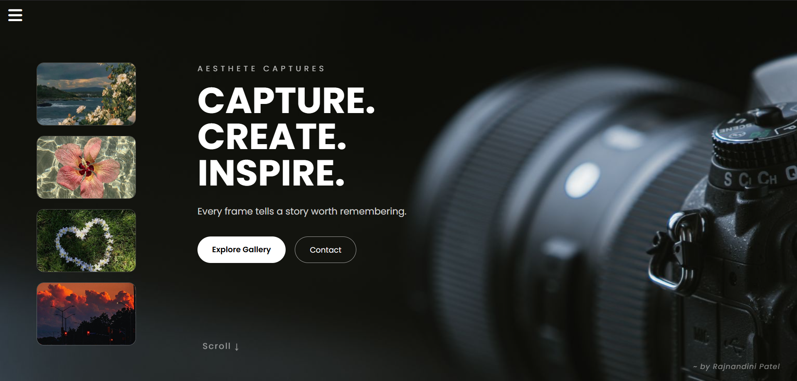

# 📸 Aesthete Captures

A modern and responsive photography landing page built using **HTML** and **CSS**. This project features a sleek dark-themed interface, an animated sidebar navigation, interactive image previews, and a minimal aesthetic inspired by professional photography portfolios.

---

## ✨ Features

- 📷 Full-screen photography hero section
- 🍔 Animated sidebar navigation menu
- 🖼️ Interactive image gallery preview
- 🎨 Smooth hover animations and transitions
- 📱 Responsive and clean UI
- 🌙 Modern dark theme
- 🔗 Social media icons
- ⚡ Pure HTML & CSS (No JavaScript)

---

## 🛠️ Technologies Used

- HTML5
- CSS3
- Font Awesome
- Google Fonts (Poppins)

---

## 📂 Project Structure

```
Aesthete-Captures/
│
├── aesthete.html
├── aesthete.css
├── images/
│   ├── mini photo.jpg
│   ├── pink.jpg
│   ├── flower.jpg.jpg
│   ├── pink2.jpg
│   └── heart.jpg.jpg
└── README.md
```

---

## 🎯 Highlights

- Smooth sliding sidebar navigation
- Elegant hero section with call-to-action buttons
- Photography preview cards with hover effects
- Minimal and visually balanced layout
- Custom typography for a premium feel

---

## 📸 Preview



> Replace `preview.png` with a screenshot of your project.

---

## 🚀 Getting Started

1. Clone the repository

```bash
git clone https://github.com/your-username/Aesthete-Captures.git
```

2. Open the project folder

```bash
cd Aesthete-Captures
```

3. Launch `mini.html` in your browser.

---

## 💡 Future Improvements

- Responsive mobile layout
- Light/Dark mode toggle
- Gallery page
- Contact form
- Image filtering by category
- Scroll animations
- Backend integration for bookings

---

## 📖 What I Learned

While building this project, I explored:

- CSS positioning
- Flexbox layouts
- Hover animations
- CSS transitions
- Sidebar navigation without JavaScript
- Responsive design principles
- UI/UX spacing and typography
- Working with Font Awesome icons

---

## 🤝 Contributing

Suggestions and improvements are always welcome.

Feel free to fork the repository and create a pull request.

---

## 📬 Connect with Me

GitHub: [https://github.com/rajnandinipatel28]

LinkedIn: [https://www.linkedin.com/in/rajnandinipatel/]

---

## ⭐ If you like this project

Give it a ⭐ on GitHub!

---

<div align="center">

Made with ❤️ by **Rajnandini Patel**

</div>
